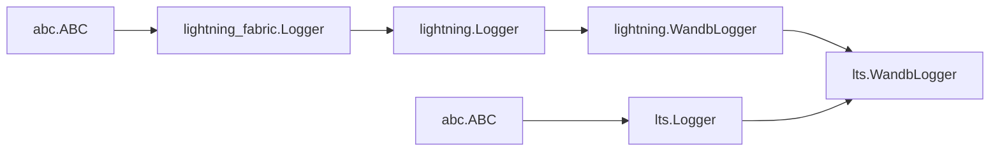

## Overview

_This post is in public draft_.

This post follows a [contribution branch](https://github.com/Lightning-Universe/Training-Studio-app/pull/269)
of lightning-training-studio and a lightning-pod-vision's visionpod.components [.hpo.work](https://github.com/JustinGoheen/lightning-pod-vision/blob/master/visionpod/components/hpo/work.py) and [.train.work](https://github.com/JustinGoheen/lightning-pod-vision/blob/master/visionpod/components/train/work.py).

The intent is to enable [grouped](https://docs.wandb.ai/guides/track/advanced/grouping) wandb runs for wandb [Sweeps](https://docs.wandb.ai/guides/sweeps) during hyperparameter optimization by creating a custom Lightning Logger to use with a lightning-training-studio [Sweep](https://github.com/Lightning-Universe/Training-Studio-app/blob/master/lightning_training_studio/components/sweep.py).

## Topics

- ML experiment management
- Hyperparameter Optimization (HPO)
- Weights & Biases Runs and Sweeps
- Lightning Loggers
- Lightning Apps for HPO Sweeps

## ML Experiment Management

### Overview

Given we are going to be using Weights & Biases as our experiment manager, we can use their current product list as a high level definition of what ML experiment management covers:

- experiment tracking and reporting
- dataset and model versioning
- model registry

Another way of thinking of this is, we can consider machine learning experiment management as any other discovery method that relies on systematic trial and error, and tracks results of individual trials.

HPO tools like wandb Sweeps provide built-in search algorithms to optimize the hyperparameter selection process; this is favorable over arbitrarily selecting combinations of hyperparameters and performing individual runs.

## Hyperparameters and HPO

### Hyperparameters

scikit-learn defines hyperparameters in [Tuning the hyper-parameters of an estimator](https://scikit-learn.org/stable/modules/grid_search.html) as:

<q>
  Hyper-parameters are parameters that are not directly learnt within
  estimators. In scikit-learn they are passed as arguments to the constructor of
  the estimator classes. Typical examples include C, kernel and gamma for
  Support Vector Classifier, alpha for Lasso, etc.
</q>

### Lightning Module Hyperparameters

In the example [visionpod.core.module](https://github.com/JustinGoheen/lightning-pod-vision/blob/master/visionpod/core/module.py) (a VisionTransform), the tuneable parameters are `lr`, `optimizer`, `dropout`, `attention_dropout`, `norm_layer` where:

- `lr` is the learning rate applied to the optimizer
- `dropout` and `attention_dropout` is the probability of an element to be zeroed
- `optimizer` is a categorical hyperparameter of [PyTorch Optimization algorithms](https://pytorch.org/docs/stable/optim.html#algorithms) such as RMSProp, Adam, or SGD.
- `norm_layer` is valid PyTorch [normalization layer](https://pytorch.org/docs/stable/nn.html#normalization-layers) layer.

The hyperparameters of a LightningModule are determined according to the layers of the network i.e. any hyperparameter that can be set in an outer or inner layer of the network can be initialized as a keyword argument of the LightningModule's \_\_init\_\_ method.

### Hyperparameter Optimization

The free text _Dive Into Deep Learning_ (d2l) has provided an entire chapter on [Hyperparameter Optimization](https://d2l.ai/chapter_hyperparameter-optimization/index.html).

d2l describes Hyperparameter Optimization (HPO) as:

<q>
  {" "}
  Hyperparameter optimization provides a systematic approach to [choosing hyperparameters],
  by casting it as an optimization problem: a good set of hyperparameters should
  (at least) minimize a validation error. Compared to most other optimization problems
  arising in machine learning, hyperparameter optimization is a nested one, where
  each iteration requires training and validating a machine learning model{" "}
</q>

### Weights & Biases Sweeps

[Weights & Biases](https://wandb.ai/site) is an MLOps platform designed for experiment tracking, dataset versioning, and model management.

- [wandb Sweeps Docs](https://docs.wandb.ai/guides/sweeps)

## Lightning Logger Classes

### Creating the Custom Logger

Inheritance Structure



The flowchart shown above is implemented as:

```python
from lightning.pytorch.loggers import WandbLogger as LitWandbLogger
from lightning_training_studio.loggers import Logger as LtsLogger

class WandbLogger(LitWandbLogger, LtsLogger):
    def __init__(*args, **kwargs):
        super().__init__(*args, **kwargs)
```

This enables us to benefit from inherited methods and attributes of the parent interfaces
while also extending them to account for [grouping wandb Sweeps](https://docs.wandb.ai/guides/track/advanced/grouping)
in the new interface (class) .

### Lightning Fabric Logger

[Lightning Fabric Logger](https://github.com/Lightning-AI/lightning/blob/master/src/lightning/fabric/loggers/logger.py) is the base class for experiment loggers. It provides a basis from which an engineer can create a new, custom Logger that will interoperate with a Lightning Trainer.

Lightning Fabric Logger provides several properties and methods; most important of which are the [`abstractmethod`](https://docs.python.org/3/library/abc.html#abc.abstractmethod)s which must be defined (overridden) in a new interface (class). Those abstract methods are:

- name: returns the experiment name
- version: returns the experiment version
- log_metrics: records metrics
- log_hyperparameters: records hyperparameters

### Lightning Logger

[Lightning Logger](https://github.com/Lightning-AI/lightning/blob/master/src/lightning/pytorch/loggers/logger.py) is an [Abstract Base Class](https://docs.python.org/3/library/abc.html#module-abc) that inherits from Lightning Fabric Logger. It extends Lightning Fabrics Logger with the following methods and attributes:

- after_save_checkpoint: called after checkpoint callback
- save_dir: a property for where the experiement logs are saved

### Lightning WandbLogger

[Lightning WandbLogger](https://github.com/Lightning-AI/lightning/blob/master/src/lightning/pytorch/loggers/wandb.py) is a custom Lightning Logger that interacts with wandb to log results during training.

Lightning WandbLogger is passed to a Lightning Trainer in the following way:

```python
from lightning.pytorch import Trainer
from lightning.pytorch.loggers import WandbLogger

trainer = Trainer(logger=WandbLogger())
```

This enables a LightningModule to use wandb when calling [self.log()](https://pytorch-lightning.readthedocs.io/en/stable/common/lightning_module.html#log) or [self.log_dict()](https://pytorch-lightning.readthedocs.io/en/stable/common/lightning_module.html#log-dict) during `training_step`, `validation_step`, and `test_step` methods or in a LightningModule [Hook](https://pytorch-lightning.readthedocs.io/en/stable/common/lightning_module.html#hooks).

Lightning WandbLogger extends the base class is several ways; however, the most important new attribute is [`experiment`](https://github.com/Lightning-AI/lightning/blob/99cb2cd056e71b516eabff30acef73bd83943d09/src/lightning/pytorch/loggers/wandb.py#L375).

`experiment` is a [wandb Run](https://docs.wandb.ai/ref/python/run) object.

### Training Studio Logger

lorem ipsum dolor sit

### Training Studio WandbLogger

[source code](https://github.com/JustinGoheen/Training-Studio-app/tree/feature/grouped-wandb-sweeps)

## Lightning Apps for HPO Sweeps

### Lightning Apps Framework

lorem ipsum dolor sit

### Lightning Training Studio Sweep

lorem ipsum dolor sit

### Lightning Pod Sweep

lorem ipsum dolor sit

## References and Resources

### Primary References

- [Lightning AI](https://lightning.ai)
- [Weights & Biases](https://wandb.ai/site)
- [Tune Hyperparameters Easily with W&B Sweeps](https://www.youtube.com/watch?v=9zrmUIlScdY)
- [Optuna Docs](https://optuna.readthedocs.io/en/stable/)
- [Optuna Paper](https://arxiv.org/abs/1907.10902)
- [Optuna Connected Papers](https://www.connectedpapers.com/main/4cdf2fad22afc865999747336c7399fe422e6e8e/graph)

### Supplemental References

- [Hyperparameter Optimization](https://d2l.ai/chapter_hyperparameter-optimization/index.html), Dive Into Deep Learning
- [Tuning the hyper-parameters of an estimator](https://scikit-learn.org/stable/modules/grid_search.html), scikit-learn
- [Overview of hyperparameter tuning](https://cloud.google.com/vertex-ai/docs/training/hyperparameter-tuning-overview), Google Vertex AI
- [Hyperparameter optimization](https://en.wikipedia.org/wiki/Hyperparameter_optimization), Wikipedia
- [Hyperparameter Tuning in Python: a Complete Guide](https://neptune.ai/blog/hyperparameter-tuning-in-python-complete-guide), Neptune AI

### Contact

If you have a question or feedback about the content, please [submit a discussion thread ](https://github.com/JustinGoheen/JustinGoheen/discussions/categories/blog-and-wiki/) on GitHub.
